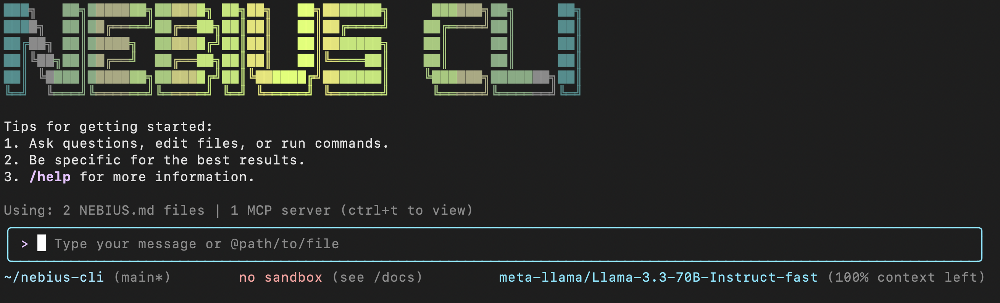

# Nebius CLI

<div align="center">



[](https://www.npmjs.com/package/@nebius-code/nebius-code)
[](./LICENSE)
[](https://nodejs.org/)
[](https://www.npmjs.com/package/@nebius-code/nebius-code)


</div>

Nebius CLI is a powerful command-line AI workflow tool built from [Google's Gemini CLI](https://github.com/google-gemini/gemini-cli), specifically optimized for Nebius models. It enhances your development workflow with advanced code understanding, automated tasks, and intelligent assistance.

## 🔑 Authentication

To get started with Nebius CLI, you'll need to authenticate using your Nebius API key:

1. **Get your API key**:
   - Visit [Nebius Studio](https://studio.nebius.com/) and sign in to your account
   - Navigate to API Keys section
   - Create a new API key or use an existing one

2. **Authenticate using one of these methods**:

   **Option 1: Command-line authentication**
   ```bash
   nebius --api-key YOUR_API_KEY
   ```
   
   **Option 2: Environment variable**
   ```bash
   export NEBIUS_API_KEY='your-api-key-here'
   nebius
   ```

   **Option 3: Interactive setup** (recommended for first-time users)
   ```bash
   nebius
   # Follow the interactive prompts to authenticate
   ```

> [!NOTE]
> Your API key is securely stored in your system's keychain after the first successful authentication. You won't need to enter it again unless you revoke it or clear your credentials.

## 🔧 GitHub Workflow Configuration

### Required Secrets
These GitHub Secrets must be configured in your repository settings for all workflows to function properly:

- `GITHUB_TOKEN`: Automatically provided by GitHub, no setup needed
- `NEBIUS_API_KEY`: Your Nebius API key for authentication
- `NEBIUS_BASE_URL`: (Optional) Base URL for the Nebius API if using a custom endpoint
- `NEBIUS_MODEL`: (Optional) Default model to use for Nebius operations

### Container Registry (Optional)
For building and publishing Docker images:
- `DOCKERHUB_USERNAME`: Your Docker Hub username
- `DOCKERHUB_TOKEN`: Your Docker Hub access token

### NPM Publishing (Optional)
For publishing to npm registry:
- `NPM_TOKEN`: NPM authentication token with publish access

### Environment Variables for Testing
For E2E and integration tests:
```bash
NO_COLOR=true  # Disables colored output in test results
```

### Workflow-Specific Configuration

#### PR Review Workflow (`.github/workflows/nebius-code-pr-review.yml`)
- Requires `GITHUB_TOKEN` with `pull-requests: write` permission
- Uses `NEBIUS_API_KEY` for code review automation

#### Container Build Workflow (`.github/workflows/build-and-publish-image.yml`)
- Requires Docker Hub credentials if pushing to Docker Hub
- Uses GitHub Container Registry by default with `GITHUB_TOKEN`

#### Release Workflow (`.github/workflows/release.yml`)
- Requires `NPM_TOKEN` for publishing to npm
- Uses `GITHUB_TOKEN` for creating releases and tags

To set up these secrets:
1. Go to your GitHub repository
2. Navigate to Settings > Secrets and variables > Actions
3. Click "New repository secret" for each required secret
4. Enter the secret name and value
5. Click "Add secret"

## Key Features

- **[Code Understanding & Editing](./docs/cli/commands.md)** - Query and edit large codebases beyond traditional context window limits
- **[Workflow Automation](./docs/issue-and-pr-automation.md)** - Automate operational tasks like handling pull requests and complex rebases
- **[Web Search](./docs/tools/web-search.md)** - Perform web searches directly from the CLI to get the latest information
- **[Fine-tuning Support](https://docs.studio.nebius.com/api-reference/fine-tuning/list-fine-tuning-jobs)** - Manage and deploy fine-tuned models with Nebius Studio's Fine-tuning API
- **[Git Worktrees](#git-worktrees)** - Work on multiple branches simultaneously with isolated contexts (see below for details)
- **[Extensions](./docs/extension.md)** - Extend functionality with custom plugins and integrations
- **[PR Review](./docs/issue-and-pr-automation.md)** - Automated code review and suggestions for pull requests
- **[Enhanced Parser](./docs/core/tools-api.md)** - Adapted parser specifically optimized for Nebius models

## Installation

### Prerequisites

Ensure you have [Node.js version 20](https://nodejs.org/en/download) or higher installed.

### Install from source

```bash
git clone https://github.com/Astrodevil/nebius-cli.git
cd nebius-cli
npm install
npm install -g .
```


## Quick Start

```bash
# Start Nebius CLI
nebius

# Example commands
> Explain this codebase structure
> Help me refactor this function
> Generate unit tests for this module
```

Tip: See full CLI command reference in [docs/cli/commands.md](./docs/cli/commands.md) and keyboard shortcuts in [docs/keyboard-shortcuts.md](./docs/keyboard-shortcuts.md).

### Session Management

Control your token usage with configurable session limits to optimize costs and performance.

#### Configure Session Token Limit

Create or edit `.nebius/settings.json` in your home directory:

```json
{
  "sessionTokenLimit": 32000
}
```

#### Session Commands

- **`/compress`** - Compress conversation history to continue within token limits
- **`/clear`** - Clear all conversation history and start fresh
- **`/stats`** - Check current token usage and limits

> 📝 **Note**: Session token limit applies to a single conversation, not cumulative API calls.

### Authorization

#### Nebius OAuth 

```bash
# Just run this command and follow the browser authentication
nebius
```

**Configuration Methods:**

1. **Environment Variables**

   ```bash
   export NEBIUS_API_KEY="your_api_key_here"
   export NEBIUS_MODEL="your_model_choice"
   ```

2. **Project `.env` File**
   Create a `.env` file in your project root:
   ```env
   NEBIUS_API_KEY=your_api_key_here
   NEBIUS_MODEL=your_model_choice
   ```

## Usage Examples

### 🔍 Explore Codebases

```bash
cd your-project/
nebius

# Architecture analysis
> Describe the main pieces of this system's architecture
> What are the key dependencies and how do they interact?
> Find all API endpoints and their authentication methods
```

### 💻 Code Development

```bash
# Refactoring
> Refactor this function to improve readability and performance
> Convert this class to use dependency injection
> Split this large module into smaller, focused components

# Code generation
> Create a REST API endpoint for user management
> Generate unit tests for the authentication module
> Add error handling to all database operations
```

### 🔄 Automate Workflows

```bash
# Git automation
> Analyze git commits from the last 7 days, grouped by feature
> Create a changelog from recent commits
> Find all TODO comments and create GitHub issues

# File operations
> Convert all images in this directory to PNG format
> Rename all test files to follow the *.test.ts pattern
> Find and remove all console.log statements
```

### 🐛 Debugging & Analysis

```bash
# Performance analysis
> Identify performance bottlenecks in this React component
> Find all N+1 query problems in the codebase

# Security audit
> Check for potential SQL injection vulnerabilities
> Find all hardcoded credentials or API keys
```

## Popular Tasks

### 📚 Understand New Codebases

```text
> What are the core business logic components?
> What security mechanisms are in place?
> How does the data flow through the system?
> What are the main design patterns used?
> Generate a dependency graph for this module
```

### 🔨 Code Refactoring & Optimization

```text
> What parts of this module can be optimized?
> Help me refactor this class to follow SOLID principles
> Add proper error handling and logging
> Convert callbacks to async/await pattern
> Implement caching for expensive operations
```

### 📝 Documentation & Testing

```text
> Generate comprehensive JSDoc comments for all public APIs
> Write unit tests with edge cases for this component
> Create API documentation in OpenAPI format
> Add inline comments explaining complex algorithms
> Generate a README for this module
```

### 🚀 Development Acceleration

```text
> Set up a new Express server with authentication
> Create a React component with TypeScript and tests
> Implement a rate limiter middleware
> Add database migrations for new schema
> Configure CI/CD pipeline for this project
```

## Commands & Shortcuts

### Session Commands

- `/help` - Display available commands
- `/clear` - Clear conversation history
- `/compress` - Compress history to save tokens
- `/stats` - Show current session information
- `/exit` or `/quit` - Exit Nebius CLI

### Git working tree management
- `/branches` - Show list of available branches and switch to the selected branches

Switch Context: Move to another Git branch without restarting the CLI
Working Trees Awareness: Keeps track of each branch as a separate working tree
Usage Tip: Use this when juggling multiple feature branches or reviewing PRs

### Keyboard Shortcuts

- `Ctrl+C` - Cancel current operation
- `Ctrl+D` - Exit (on empty line)
- `Up/Down` - Navigate command history

## 📚 Documentation

Explore the comprehensive documentation to get the most out of Nebius CLI:

### Core Documentation
- **[Overview](./docs/index.md)**: Introduction to Nebius CLI and its architecture
- **[Architecture](./docs/architecture.md)**: High-level design and component interactions
- **[Checkpointing](./docs/checkpointing.md)**: Save and restore conversation states
- **[Sandbox](./docs/sandbox.md)**: Information about the sandboxed execution environment
- **[Keyboard Shortcuts](./docs/keyboard-shortcuts.md)**: Quick reference for keyboard commands

### CLI Documentation
- **[CLI Commands](./docs/cli/commands.md)**: Comprehensive list of all available commands
- **[Authentication](./docs/cli/authentication.md)**: Setup and manage authentication methods
- **[Configuration](./docs/cli/configuration.md)**: Customize Nebius CLI behavior
- **[Themes](./docs/cli/themes.md)**: Customize the CLI appearance
- **[Tutorials](./docs/cli/tutorials.md)**: Step-by-step guides for common tasks

### Core API
- **[Tools API](./docs/core/tools-api.md)**: Extend functionality with custom tools
- **[Memory Port](./docs/core/memport.md)**: Manage AI memory and context

### Built-in Tools
- **[File System](./docs/tools/file-system.md)**: Interact with local files and directories
- **[Shell Commands](./docs/tools/shell.md)**: Execute shell commands safely
- **[Web Search](./docs/tools/web-search.md)**: Search the web directly from the CLI
- **[Web Fetch](./docs/tools/web-fetch.md)**: Fetch and process web content
- **[Multi-file Operations](./docs/tools/multi-file.md)**: Work with multiple files simultaneously
- **[Memory Management](./docs/tools/memory.md)**: Control how the AI remembers information

### Additional Resources
- **[Extension Development](./docs/extension.md)**: Create custom extensions
- **[Issue and PR Automation](./docs/issue-and-pr-automation.md)**: Automate GitHub workflows
- **[Fine-tuning Guide](https://docs.studio.nebius.com/api-reference/fine-tuning/list-fine-tuning-jobs)**: Learn how to create and manage fine-tuned models
- **[Uninstall Guide](./docs/Uninstall.md)**: Completely remove Nebius CLI

## Git Worktrees

Git worktrees allow you to work on multiple branches simultaneously, each in its own directory. This is particularly powerful with Nebius CLI as it maintains separate AI contexts for each worktree.

### Why Use Worktrees?

- **No more context switching** - Keep different features/branches completely isolated
- **Parallel development** - Work on multiple tasks without stashing or committing
- **Preserved AI context** - Each worktree maintains its own Nebius CLI context
- **Clean history** - No more "WIP" or "temp" commits

### Basic Workflow

```bash
# Create a new worktree for a feature branch
git worktree add ../my-project-feature -b feature/new-feature

# Navigate to the new worktree
cd ../my-project-feature

# Start Nebius CLI in this worktree
nebius
```

### Common Commands

```bash
# List all worktrees
git worktree list

# Remove a worktree (after you're done)
git worktree remove ../my-project-feature

# Prune worktree info after manual deletion
git worktree prune
```

### Advanced Usage

#### Compare Branches Side-by-Side
```bash
# Main project in one terminal
cd ~/projects/my-project
nebius

# Feature branch in another terminal
git worktree add ~/projects/my-project-feature feature/awesome-feature
cd ~/projects/my-project-feature
nebius
```

#### Work with Pull Requests
```bash
# Checkout a PR locally
git worktree add ../pr-1234 -b pr-1234 origin/pr/1234
cd ../pr-1234
nebius
```

### Best Practices

1. **Organize worktrees** by feature/bugfix name
2. **Clean up** when done to save disk space
3. **Use separate terminals** for each worktree
4. **Leverage shell aliases** for common worktree operations

### Example Shell Aliases

Add these to your `~/.zshrc` or `~/.bashrc`:

```bash
# Create and switch to new worktree
git-worktree-new() {
    git worktree add -b $1 ../$1
    cd ../$1
}

# List worktrees
alias git-worktree-ls='git worktree list'

# Remove worktree
git-worktree-rm() {
    git worktree remove $1 --force
    rm -rf ../$1
}
```

## Development & Contributing

For detailed authentication setup, see the [authentication guide](./docs/cli/authentication.md).

Common quick fixes:

- Ensure you are on Node.js 20 or later: `node -v`
- Clear CLI cache: remove `~/.nebius/` if you suspect corrupted state
- Re-authenticate: run `nebius` then use the `/auth` command
- Network restricted? Configure proxy via environment variables before launching

If problems persist, see Support below.

## Acknowledgments

This project is based on [ Gemini CLI](https://github.com/google-gemini/gemini-cli). We acknowledge and appreciate the excellent work of the Google CLI team. Our main contribution focuses on parser-level adaptations to better support Nebius models.

## Support

- For product support or account issues: ai-studio-support@nebius.ai
- To report a bug from the CLI: use the `/bug` command which will prefill system details
- Documentation and guides: `docs/`

